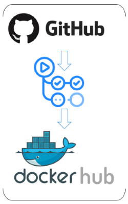
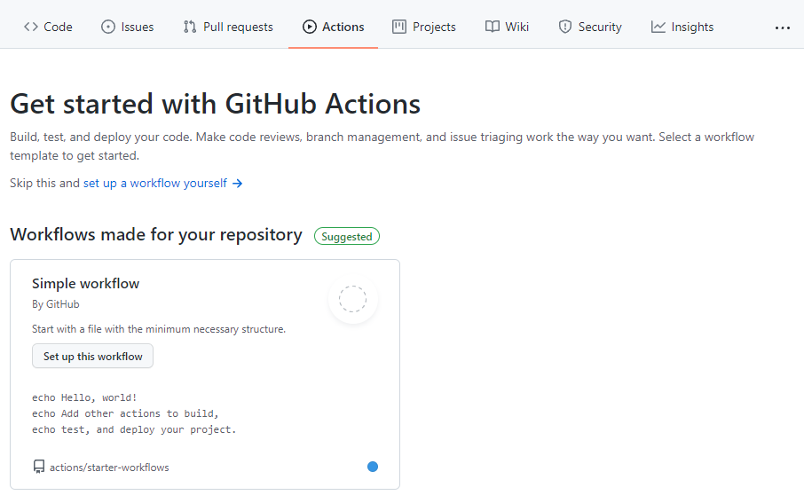

# Exercise 2.1: Setup Continuous Integration

In this exercise, you will set up a *Continuous Integration* (CI) workflow using GitHub as a version control system, GitHub Actions as a build tool, and DockerHub as artifact repository manager. This workflow will execute the unit tests of the source code and build the code. To trigger it, a change of the codebase must be performed. 

## Setup



## Requirements

* GitHub account :octocat: 
    <details><summary>Click here for sign-up instructions.</summary>
    <p>

    To sign up:  https://github.com/join

    </p>
    </details>

## Instructions

1. Create a **public** GitHub repository called: `mini-ci-example`

1. Add and commit `main.go`, `main_test.go`, `fib.go`, `fib_test.go`, and `go.mod` to your repository via drag-and-drop.

1. In GitHub, go to **Actions** and set up a GitHub workflow by clicking `set up a workflow yourself`:



1. Create file `CI.yml` in the folder `.github/workflows` of your repository and copy-paste the content from the provided `CI.yml` file. 

```yaml
name: CI

# Controls when the workflow will run
on:
  # Triggers the workflow on push or pull request events but only for the master branch
  push:
    branches: [ main ]
  pull_request:
    branches: [ main ]

  # Allows you to run this workflow manually from the Actions tab
  workflow_dispatch:

# A workflow run is made up of one or more jobs that can run sequentially or in parallel
jobs:
  # This workflow contains a single job called "continuous_integration"
  continuous_integration:
    # The type of runner that the job will run on
    runs-on: ubuntu-latest

    # Steps represent a sequence of tasks that will be executed as part of the job
    steps:
      # Checks-out your repository under $GITHUB_WORKSPACE, so your job can access it
      - uses: actions/checkout@v2

      # Runs a single command using the runners shell
      - name: Run a one-line script
        run: echo Start to test and build the artifact

      # Runs a set of commands using the runners shell
      - name: Run test and build
        run: |
          go test -v ./...
          CGO_ENABLED=0 GOARCH=amd64 go build -o demo
```

1. Trigger the GitHub Action build by a code change, e.g., change "Hello" to "Hi there" in the file `./main.go`

1. Watch GitHub Action executing your tests and building the artifact.

    :mag: What is your observation? 

