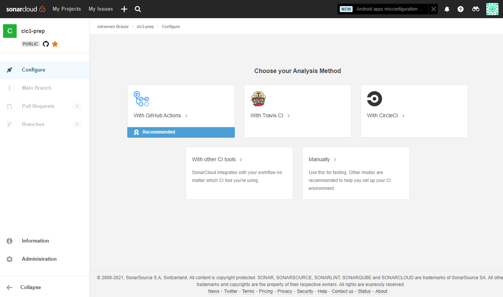

# Optional Exercise 2.3: Scan code with SonarCloud triggered by GitHub Actions

In this exercise, you will scan your code with [SonarCloud](https://sonarcloud.io/) to detect bugs, vulnerabilities, and code smells. To trigger a scan, a GitHub Action will be configured that reacts on each new Pull Request (PR).

*Info:* SonarCloud is a leading product for Continuous Code Quality & Code Security online, totally free for open-source projects. It supports all major programming languages, including Java, JavaScript, TypeScript, C#, C/C++ and many more. If your code is closed source, SonarCloud also offers a paid plan to run private analyses.

## Requirements

* SonarCloud Account account

    <details><summary>Click here for sign-up instructions.</summary>
    <p>

    To sign up: https://sonarcloud.io/sessions/init/github

    </p>
    </details>

* The repository to analyze is set up on SonarCloud. [Set it up](https://sonarcloud.io/projects/create) in just one click.

* Exercise 2.2 completed

## Instructions

1. Once the repository is set up on SonarCloud, select the repository and go to `Configure`:

    

1. Select: `With GitHub Actions` and follow the instructions.

    * Create a GitHub Secret, go to `Settings` > `Secrets and variables` > `Actions` > and enter the provided value for the key `SONAR_TOKEN`.

    * Instead of creating the file `.github/workflows/build.yml`, we extend the `CI.yaml` by adding the following step before *Run test and build*: 

    ```yaml
    # Run SonarCloud scan
    - name: SonarCloud scan
      uses: SonarSource/sonarcloud-github-action@master
      env:
        GITHUB_TOKEN: ${{ secrets.GITHUB_TOKEN }}  # Needed to get PR information, if any
        SONAR_TOKEN: ${{ secrets.SONAR_TOKEN }}
    ```

    * Create a `sonar-project.properties` file on `main`/`master` branch:
    
    ```
    sonar.projectKey=[YOUR-GITHUB-ORG]_mini-ci-example
    sonar.organization=[YOUR-GITHUB-ORG]

    # This is the name and version displayed in the SonarCloud UI.
    #sonar.projectName=mini-ci-example
    #sonar.projectVersion=1.0

    # Path is relative to the sonar-project.properties file. Replace "\" by "/" on Windows.
    #sonar.sources=.

    # Encoding of the source code. Default is default system encoding
    #sonar.sourceEncoding=UTF-8
    ```

1. Disable `Automatic Analysis` on the project in SonarCloud: `Administration` > `Analysis Method` > `Automatic Analysis` : **disabled**

1. Create a `feature` branch: `git checkout -b feature/add-fibo`

1. On the `feature` branch make a code change and commit this change. 

1. File a Pull Request (PR) that integrates the code change from the `feature` branch into the `main` branch. 

1. Watch the GitHub Action triggering SonarCloud to scan your code. 

:mag: Go to your SonarCloud account and find your check out the code analysis. 

<details><summary>Optional config steps:</summary>
<p>

* *Optional*: You can change the analysis base directory by using the optional input `projectBaseDir` like this:

    ```yaml
    uses: sonarsource/sonarcloud-github-action@v1.6
    with:
    projectBaseDir: my-custom-directory
    ```

* *Optional*: In case you need to add additional analysis parameters, you can use the `args` option shown below. More information about possible analysis parameters is found in the documentation [here](https://sonarcloud.io/documentation/analysis/analysis-parameters/).

    ```yaml
    - name: Analyze with SonarCloud
      uses: sonarsource/sonarcloud-github-action@v1.6
      with:
        projectBaseDir: my-custom-directory
        args: >
        -Dsonar.organization=my-organization
        -Dsonar.projectKey=my-projectkey
        -Dsonar.python.coverage.reportPaths=coverage.xml
        -Dsonar.sources=lib/
        -Dsonar.test.exclusions=tests/**
        -Dsonar.tests=tests/
        -Dsonar.verbose=true
    ```

* *Optional*: To add SonarCloud status to the README.md:
    1. Open your SonarCloud project
    1. Click **Get project badges** button
    1. Copy the badge link based on your selection on *Metric* and *Format*:

    ```
    [](https://sonarcloud.io/dashboard?id=com.lapots.breed.judge:judge-rule-engine)
    ```
</p>
</details>

### Secrets

- `SONAR_TOKEN` – **Required** this is the token used to authenticate access to SonarCloud. You can generate a token on your [Security page in SonarCloud](https://sonarcloud.io/account/security/). You can set the `SONAR_TOKEN` environment variable in the "Secrets" settings page of your repository.

- `GITHUB_TOKEN` – Provided by Github (see [Authenticating with the GITHUB_TOKEN](https://help.github.com/en/actions/automating-your-workflow-with-github-actions/authenticating-with-the-github_token)).*


