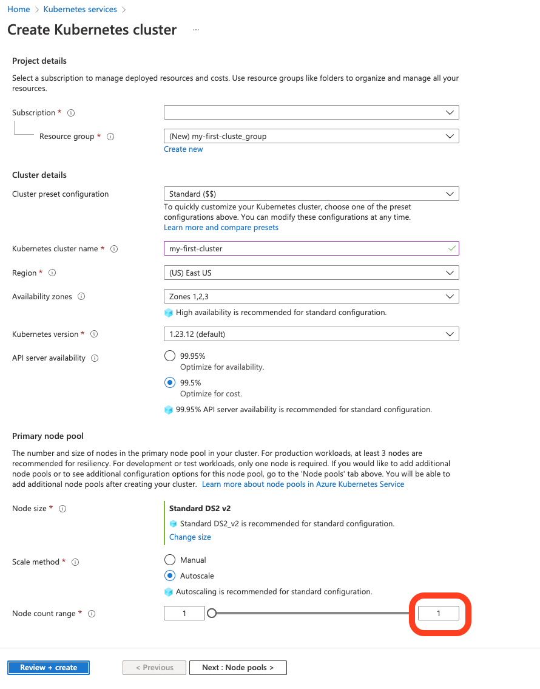

# Exercise 3.1: Setup of a Kubernetes Cluster

In this exercise, you will create your own Kubernetes cluster hosted on a public cloud provider. For the following exercises, you can either use the [Google Kubernetes Engine (GKE)](https://cloud.google.com/kubernetes-engine/) or the [Azure Kubernetes Service (AKS)](https://azure.microsoft.com/en-us/services/kubernetes-service/).
In case you have no access to a public cloud (because e.g. you do not have a credit card, already used the free credits), you can also start a k8s cluster locally using [kind](https://kind.sigs.k8s.io/docs/user/quick-start/) or [minikube](https://minikube.sigs.k8s.io/docs/start/).


## Google Kubernetes Engine (GKE)

### Prerequisites
1. Account in [Google Cloud](http://cloud.google.com/)

1. Install the [Google Cloud SDK](https://cloud.google.com/sdk/install). After installing the Google Cloud SDK, you have the command-line tool *gcloud* available in your terminal. 

    Run the command: 
    ```console
    gcloud version
    ```
 
 1. Run the `kubectl` installation command:

    ```console
    gcloud components install kubectl
    ```

### Setup the Cluster
1. In your terminal, execute the following command and follow the steps:

    ```console
    gcloud auth login
    ```

1. Open the [Kubernetes Engine Overview](https://console.cloud.google.com/kubernetes)

1. Click on *Create Cluster* and select "Standard: you manage your cluster"

1. Create a cluster with the *default* settings except for the *Number of nodes* where you only need 1:

    
    

1. As soon as your cluster is ready, click on *Connect* and copy and paste this command into your terminal

1. Now your `kubectl` (i.e., the Kubernetes command-line tool) should be configured for your cluster. In order to verify this, execute the command: 

    ```console
    kubectl get nodes
    ```

## Azure Kubernetes Service (AKS) 

### Prerequisites
1. Account in [Microsoft Azure Cloud](https://azure.microsoft.com/)

1. Install the [Azure CLI](https://docs.microsoft.com/en-us/cli/azure/install-azure-cli?view=azure-cli-latest)

1. After installing the Azure CLI, you have the command-line tool `az` available in your terminal:

    ```console
    az --version
    ```

1. To install `kubectl`, execute the command:

    ```console
    az aks install-cli
    ```

### Setup the Cluster
1. In your terminal, execute the following command and follow the steps:

    ```console
    az login
    ```

1. Open the [Azure Portal](https://portal.azure.com/) and select *Kubernetes services*

1. Click on *Create* and select "Create a Kubernetes cluster"

1. Select a *Subscription*, *Resource group* (if necessary, create a new group)

1. As *Kubernetes cluster name* choose any name (e.g., `myname-cluster`)

1. For the *Node size* select *DS2_v2* and for the *Node count* select 1:

    

1. Click *Review + create* and after the validation click *Create*

1. As soon as your cluster is created, execute the following command in your terminal:

    ```console
    az aks get-credentials --resource-group YOUR-RESOURCE-GROUP --name MYNAME-CLUSTER
    ```

## Kind

`kind` is a tool for running local Kubernetes clusters using Docker container “nodes”.

### Prerequisites
1. [Docker](https://docs.docker.com/get-docker/)

1. Install `kind` by following the installation instructions provided in the [quick start](https://kind.sigs.k8s.io/docs/user/quick-start/)

### Creating a local Cluster 
1. In your terminal, execute the following command:

    ```console
    kind create cluster
    ```

1. Print the cluster info by executing the following command:

    ```console
    kubectl cluster-info --context kind-kind
    ```

## minikube

`minikube` minikube is local Kubernetes, focusing on making it easy to learn and develop for Kubernetes."

### Starting a local Cluster 
1. In your terminal, execute the following command:

    ```console
    minikube start
    ```

1. Print the cluster info by executing the following command:

    ```console
    kubectl cluster-info
    ```
